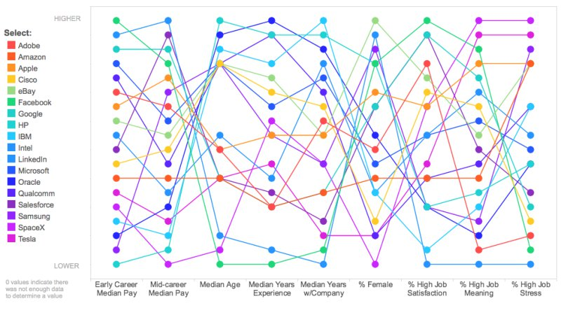

```{r setup, include=FALSE}
knitr::opts_chunk$set(echo = TRUE)
if (!require(tidyverse)) {
  install.packages("tidyverse", repos = "https://cloud.r-project.org/")
  if (!require(tidyverse)) {
    stop("Could not install required package")
  }
}
```
# Question 1
## Aviation Accidents and Fatalities, 1975-2014

This data set is provided by the NTSB, found [here](https://catalog.data.gov/dataset/accidents-fatalities-and-rates-1995-through-2014-u-s-general-aviation). Initially, it was poorly formatted and unusable, but since it is a small dataset, I was able to quickly manually clean up the data.

The data set contains the number of aviation accidents (All) from 1975 to 2014. For each year, the number of fatal accidents (Fatal), the total number of fatalities (Total), number of fatalaties aboard flights (Aboard), and flight hours logged that year (Flight.Hours).

I decided to run a multiple linear regression on the datase to predict the number of accidents from the year and flight hours. While flight hours alone isn't a reliable predictor of accidents, the year and flight hours together predict the number of total accidents fairly reliably with an adjusted R^2 value of 0.89. This is likely due to an increase in safety standards and technology combined with the increase in the average size of commercial airplanes over the years.

## Total accidents per year
Points sized by number of fatalities, alpha is flight hours per year. This plot tells us there is a correlation between both year and flight hours and total number of annual accidents.

### Old Visualization
```{r}
dataGov <- read_csv("aviation_accidents-2014.csv")
ggplot(data = dataGov) + 
  geom_point(mapping = aes(x = Year, y = All, size = Total, alpha = Flight.Hours))
```

### Improved Visualization

```{r}

dataGov <- dataGov %>% 
  mutate(All = All - Fatal) %>%
  rename(Accidents = All,
         Fatalities = Fatal) %>%
  gather(key = Type, value = Number, Accidents, Fatalities)

ggplot(dataGov) +
  geom_line(aes(x = Year, y = Number/Flight.Hours, color = Type, linetype = Type)) +
  theme(panel.background = element_blank(), # backgound/axis
        axis.line = element_line(colour = "black", size=.1),
        legend.key = element_rect(fill = "white")) +
  scale_x_continuous(breaks=c(1975, 1988, 2001, 2014),
                     limits=c(1975, 2014),
                     expand=c(.05,.05)) +
  labs(x='Year',
       y='Accidents per flight hour',
       title='Aviation accidents and fatalities per flight hour from 1975-2014')

```

The message of the plot is that between 1975 and 2014, aviation accidents and fatalities have decreased.

The main improvement would be separating the data and graphing fatal and non-fatal accidents as lines instead of tacking fatalities onto a scatter plot using the size of the points. Additionally, I removed any extraneous noise such as colored background and the grid. I added more descriptive labels throughout the plot and added a title. I fitted the tick marks of the x-coordinates to more accurately convey the data, and finally, I added both coloration and different line types to the lines to clearly differentiate between incident types.


# Question 2
## Bad visualization


#### Where to begin? Everything is wrong with this visualization. Here are the main issues:
* Message seems to have something to do with job satisfaction/pay/gender/age statistics for tech companies
* Too much information in one visualization
* Unclear representation of information (scale?)
* Lines connecting points serve no purpose
* Why use a scatter plot?
* Two changes would make an enormous differentce:
** Make a separate graph for each variable/statistic
** Use bar graphs instead of lines/scatter plots

